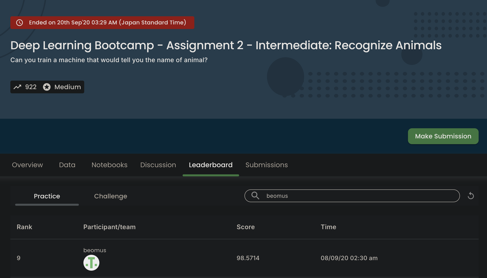

# Animal recognizer

It was done as a part of the Deep Learning Intermediate Bootcamp from Dphi

Here's the [certificate](https://aiplanet.com/bootcamp/certificate/download/caf2348c-e0b6-474b-8b52-c4e401d655b0/)
or [here](https://aiplanet.com/bootcamp/certificate/verify/caf2348c-e0b6-474b-8b52-c4e401d655b0).

Here's the training notebook - [animal-recognizer.ipynb](animal-recognizer.ipynb)

> It was also nominated as one of the "best" intermediate notebooks. See [https://github.com/aiplanethub/Deep_Learning_Bootcamp/blob/master/Assignment2_Best_Notebooks/Best_Notebooks_Intermediate/Hau_Le.ipynb](https://github.com/aiplanethub/Deep_Learning_Bootcamp/blob/master/Assignment2_Best_Notebooks/Best_Notebooks_Intermediate/Hau_Le.ipynb)

## Result

Here's the [result](https://aiplanet.com/challenges/30/deep-learning-bootcamp-assignment-2-intermediate-recognize-animals-30/leaderboard/practice)

Screenshot below in case things get removed:

## Dataset

The training dataset consists of about 9k medium quality animal images belonging to 5 categories: butterfly, sheep, cow, squirrel, elephant. - mucca (cow), pecora (sheep), elefante (elephant), farfalla (butterfly) and scoiattolo (squirrel). 

All the images have been collected from "google images" and have been checked by human. There is some erroneous data to simulate real conditions (eg. images taken by users of your app).

Dataset Link: https://drive.google.com/file/d/176E-pLhoxTgWsJ3MeoJQV_GXczIA6g8D/view?usp=sharing

From the above link you will be able to download a zip file named ‘animal_dataset_intermediate.zip’. After you extract this zip file, you will get three files:

- train - contains five folders each folder containing images around 1000 to 2000 of those 5 five animals.  Each image has a unique name.

- test - contains 910 random images of those 5 animals whose predictions you are to submit on DPhi platform.

- Testing_set_animals.csv - this is the order of the predictions for each image that is to be submitted on the platform. Make sure the predictions you download are with their image’s filename in the same order as given in this file.