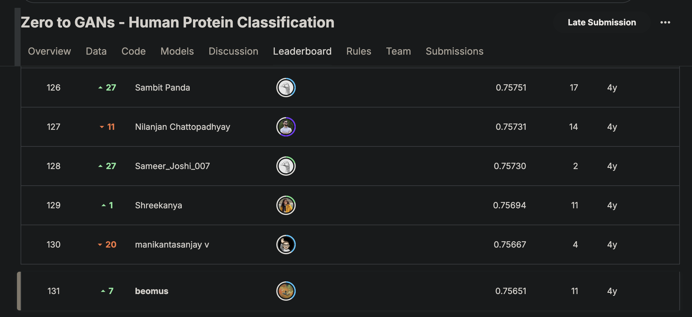

# Human protein classifier

This was an assignment as part of the course [Deep Learning with PyTorch: Zero to GANs](https://jovian.com/learn/deep-learning-with-pytorch-zero-to-gans).

Here's the training notebook - [human-protein.ipynb](human-protein.ipynb)

The dataset can be found in [Zero to GANs - Human Protein Classification](https://www.kaggle.com/competitions/jovian-pytorch-z2g) but here's the [description](#dataset) in case things get removed.

Here's the [certificate](https://jovian.com/certificate/MFQWCNRUGA) and the PDF.

## Result

Here's the [leaderboard](https://www.kaggle.com/c/jovian-pytorch-z2g/leaderboard).

---

## Dataset

Dataset contains 512x512 resolution images of 3 channels (RGB). Images are in PNG format.
Train set contains - 19236 images
Test set contains - 8243 images (Public leaderboard results are from just 40%(3297 images) of this and rest 60% will be used for private leaderboard)

## What am I predicting?

You are predicting protein organelle localization labels for each sample. There are in total 10 different labels present in the dataset. The dataset is acquired in a highly standardized way using one imaging modality (confocal microscopy). However, the dataset comprises 10 different cell types of highly different morphology, which affect the protein patterns of the different organelles. Each image can have 1 or more labels associated to them.

The labels are represented as integers that map to the following:

- 0: 'Mitochondria'
- 1: 'Nuclear bodies'
- 2: 'Nucleoli'
- 3: 'Golgi apparatus'
- 4: 'Nucleoplasm'
- 5: 'Nucleoli fibrillar center'
- 6: 'Cytosol'
- 7: 'Plasma membrane'
- 8: 'Centrosome'
- 9: 'Nuclear speckles'

## File descriptions

- Human protein atlas.zip - Contains train,test,train.csv
- train/ - Contains all images of training set, should be used to train the model
- test/ - Contains all images of test set, should be used to predict and to submit
- train.csv - filenames of images in train folder and corresponding labels
- sample_submission.csv - format of how submission csv file should be like. Test filenames with '0' as label

## Data fields

train.csv and sample_submission.csv contains two columns

- 'Image' - List of filenames
- 'Label' - Labels associated to a image
